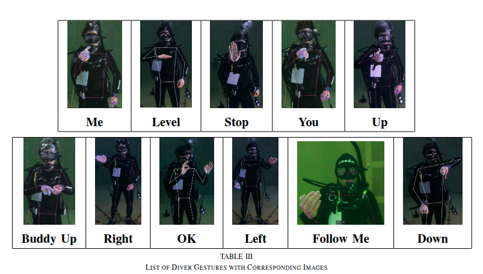

# Scuba-Gesture-Dataset (SGD11)

The aim of the SCUBA Gesture dataset is to further the state-of-the-art (SOTA) in underwater human-robot-interaction (UHRI) research by providing a **robust source of training data for static and dynamic action/gesture recogntion** algorithms, and a standardized set of test data for offline evaluation of diver gesture recognition pipeline performance, assessed across a dynamic set of gestures (for more information on pipeline evaluation, see [pipeline evaluation](#pipeline-evaluation)).

 The datset currently consists of **1100** videos of diver actions/gestures of **11** different classes.
 This includes including **220** videos with synchronized diver pose data.​

The majority the the current dataset are video sequences of approximately 2 seconds in length, where each video contains only one gesture.


Currently Available Gestures
---




<!-- | Name | Example | Videos | Size | Link |
|-------|------|-------:|-----:|---|
| OKAY |   |     220 | 1.7GB | [gesture videos](https://www.dropbox.com/scl/fo/mqd4pnlf5uz2e6x9t6np2/AATzzlmMlMY6gMHXm7nzCCQ?rlkey=xdhr1ftz3q4o9roery6xs2j1n&st=m7yt9zti&dl=0)
| YOU |   |     952  | 8.6GB | [gesture videos](https://www.dropbox.com/scl/fo/bjyt0ru7wa9oftth5fhdd/ALPHEdSlcx2r6hsgH7Iu3RI?rlkey=7mnk676wajqtz1ke98snjod0l&st=5xidsfhw&dl=0)
| ME |   |     182 | 1.4GB | [gesture videos](https://www.dropbox.com/scl/fo/6636d1doeft0h4ly8c8sx/ADBDO2vND_HyuiqP6y0CS8c?rlkey=iifb1u4x8dqnyips4ic450v50&st=9htthu6f&dl=0)
| LEVEL |   |     367 | 5.2GB | [gesture videos](https://www.dropbox.com/scl/fo/wowtlt55gg5yw66574s9g/APno67MchrgYi-0m5Eug6CM?rlkey=s85i1rd9c9uryulnjwe1dwf4e&st=wi5moclf&dl=0)
| LEFT |  |     391  | 3.1GB | [gesture videos](https://www.dropbox.com/scl/fo/f8hpeaf8lr5pxn21x2zsq/AK8PFia3qcCvgMtURf97yqw?rlkey=uyn876hew7ze3nos4rtwlgfm6&st=52syustq&dl=0)
| RIGHT |  |     1174 | 9.3GB | [gesture videos](https://www.dropbox.com/scl/fo/wjmi5hqof16gnw935rb3s/ACW6fEw0zWV0Frk0Cdv0ijc?rlkey=3q2lnftfjf8er4pr7465w5zmz&st=nb40eqa1&dl=0)
| ASCEND |  |     539 | 4.4GB | [gesture videos](https://www.dropbox.com/scl/fo/euz15j7w3x0cksc0x6tei/AAX6CGsgkajsx0kbHuoOnsc?rlkey=q8aj4lkvbxiugelxe2f3wp67c&st=7acxx4gr&dl=0)
| DESCEND |  |     783  | 6.1GB | [gesture videos](https://www.dropbox.com/scl/fo/8yvv66exiqqioqqrsibds/ABSjSAlBxj-0L2jksfgKeoo?rlkey=i9iy8kqdqkpg5v5pf0iu62086&st=jim9peaz&dl=0)
| BUDDY UP |  |     684  | 792MB | [gesture videos](https://www.dropbox.com/scl/fo/9249p9x16pghzhxojg6wa/AIyhohQkP9ypSJx3ofHKh8s?rlkey=aty2ukhw29qbwtmz267uolrq0&st=9za27ioe&dl=0)
| FOLLOW ME |  |     98 | 1.3GB | [gesture videos](https://www.dropbox.com/scl/fo/pg53be2us3ju6sdb25fdn/AO-lBTEZJOniEqViOb8p0tI?rlkey=h96dzm5hbn4vm3qjxrkwab4r9&st=pybchl9z&dl=0)
| STOP |  |     98 | 1.3GB | [gesture videos](https://www.dropbox.com/scl/fo/fbft7kjnej7f0q8u1oray/ABad602M9iHPL9gmxPAAnAY?rlkey=tdpyqa8pgiu7w85skfmb1ogwc&st=84ahtmoe&dl=0) -->

## Total videos per class

| Name      | Videos | Size | Link |
|-----------|--------:|-----:|------|
| OKAY      |      81 | - | [gesture videos](https://www.dropbox.com/scl/fo/mqd4pnlf5uz2e6x9t6np2/AATzzlmMlMY6gMHXm7nzCCQ?rlkey=xdhr1ftz3q4o9roery6xs2j1n&st=m7yt9zti&dl=0) |
| YOU       |      78 | - | [gesture videos](https://www.dropbox.com/scl/fo/bjyt0ru7wa9oftth5fhdd/ALPHEdSlcx2r6hsgH7Iu3RI?rlkey=7mnk676wajqtz1ke98snjod0l&st=5xidsfhw&dl=0) |
| ME        |      83 | - | [gesture videos](https://www.dropbox.com/scl/fo/6636d1doeft0h4ly8c8sx/ADBDO2vND_HyuiqP6y0CS8c?rlkey=iifb1u4x8dqnyips4ic450v50&st=9htthu6f&dl=0) |
| LEVEL     |      76 | - | [gesture videos](https://www.dropbox.com/scl/fo/wowtlt55gg5yw66574s9g/APno67MchrgYi-0m5Eug6CM?rlkey=s85i1rd9c9uryulnjwe1dwf4e&st=wi5moclf&dl=0) |
| LEFT      |      85 | - | [gesture videos](https://www.dropbox.com/scl/fo/f8hpeaf8lr5pxn21x2zsq/AK8PFia3qcCvgMtURf97yqw?rlkey=uyn876hew7ze3nos4rtwlgfm6&st=52syustq&dl=0) |
| RIGHT     |      79 | - | [gesture videos](https://www.dropbox.com/scl/fo/wjmi5hqof16gnw935rb3s/ACW6fEw0zWV0Frk0Cdv0ijc?rlkey=3q2lnftfjf8er4pr7465w5zmz&st=nb40eqa1&dl=0) |
| ASCEND    |      82 | - | [gesture videos](https://www.dropbox.com/scl/fo/euz15j7w3x0cksc0x6tei/AAX6CGsgkajsx0kbHuoOnsc?rlkey=q8aj4lkvbxiugelxe2f3wp67c&st=7acxx4gr&dl=0) |
| DESCEND   |      75 | - | [gesture videos](https://www.dropbox.com/scl/fo/8yvv66exiqqioqqrsibds/ABSjSAlBxj-0L2jksfgKeoo?rlkey=i9iy8kqdqkpg5v5pf0iu62086&st=jim9peaz&dl=0) |
| BUDDY UP  |      80 | - | [gesture videos](https://www.dropbox.com/scl/fo/9249p9x16pghzhxojg6wa/AIyhohQkP9ypSJx3ofHKh8s?rlkey=aty2ukhw29qbwtmz267uolrq0&st=9za27ioe&dl=0) |
| FOLLOW ME |      77 | - | [gesture videos](https://www.dropbox.com/scl/fo/pg53be2us3ju6sdb25fdn/AO-lBTEZJOniEqViOb8p0tI?rlkey=h96dzm5hbn4vm3qjxrkwab4r9&st=pybchl9z&dl=0) |
| STOP      |      84 | - | [gesture videos](https://www.dropbox.com/scl/fo/fbft7kjnej7f0q8u1oray/ABad602M9iHPL9gmxPAAnAY?rlkey=tdpyqa8pgiu7w85skfmb1ogwc&st=84ahtmoe&dl=0) |


 Download the full dataset here
---
Download Links: https://www.dropbox.com/scl/fo/5rxj3gthms3urg4lqajwk/AFigP8iOmR46MKk3KaxDoWs?rlkey=t65wimousvyamofma9w5f93xm&st=3z4hfw5l&dl=0


Dataset Folder Structure
---

```
Public_dataset/
   - OKAY
      - OKAY_TANK_VERTICAL_1f8s0f8an4.MP4
      - OKAY_TANK_VERTICAL_1f8s0f8an4.MP4
      - OKAY_TANK_VERTICAL_1f8s0f8an4.MP4
      ...
   - BUDDY_UP
      - BUDDYUP_TANK_VERTICAL_1f8s0f8an4.MP4
      - BUDDYUP_TANK_VERTICAL_1f8s0f8an4.MP4
      - BUDDYUP_TANK_VERTICAL_1f8s0f8an4.MP4
      ...
   - RIGHT
      ...
    ...
```

<!-- The `cameras.xml` contains the poses of each camera along with the distortion parameters, intrinsics and extrinsics. See `tools/util.py` for working with this file directly. The `images` directory contains the images and `points/points.ply` contains the dense pointcloud with `x,y,z,red,green,blue`. -->

Tools
---

The `tools` directory contains an expanding collection of tools for working with and transforming the dataset. Contributions are welcome.

<!-- `tools/dd2ngp.py` - create a `cameras.json` ready for use with [Instant Neural Graphics Primitives](https://github.com/NVlabs/instant-ngp). The default `cameras.json` is included in each zip of the dataset and uses the 50 nearest images to the center of the scene. If you want to use different cameras you can use this script to re-generate a `cameras.json`. -->

Usage
---
---

## Training

The videos can be used for model training. Simply download the videos you need for training your model. We provide an example class for loading specific data of interest from the dataset.
<!-- ```sh

instant-ngp$ ./build/testbed --scene ./datasets/house1/cameras.json
```


or

```sh
python scripts/run.py --mode="nerf" --scene="house1/cameras.json" --screenshot_transforms="house1/cameras.json"  --width="1216" --height="912" --screenshot_dir="house1/output" --near_distance="0"  --screenshot_spp="16"
```
 -->

## Pipeline Evaluation

A key initiative of this work is to establish a **large, open-source dataset** to serve as a standard benchmark for diver action and gesture recognition. By providing a publicly available dataset along with standardized evaluation procedures and metrics, we aim to create a consistent and reproducible framework for assessing different recognition pipelines.

Currently, it is challenging to systematically determine what contributes to improvements in diver gesture recognition. Ambiguities exist regarding whether variations in performance are due to differences in image quality, model training strategies, underwater image enhancement techniques (or lack thereof), or the choice of model architecture (e.g., CNNs, LSTMs, Transformers). By establishing a common dataset and evaluation criteria, we enable researchers to scientifically compare different approaches, identify key factors driving improvements, and ultimately advance the robustness and reliability of diver gesture recognition systems.

Provided is an example jupyer notebook for loading the desired component of the dataset you would like to test over, loading the data, and running inference on a pretrained model.

Model results are evaluated using a confusion matrix over the classes tested, with results averaged over 10 runs.

Multi-class F-score is also computed as a metric, also averaged over 10 runs.

How to Contribute your own data
---

Please contribute your scuba diving gesture data! Follow the instructions in 'dataset_contribution_guide.md'

## License and Citation

```bibtex
@misc{coming soon!},
}
```

This work is made available for academic use under [CC BY-NC-SA](https://creativecommons.org/licenses/by-nc-sa/4.0/).

 <!-- For commercial use and queries please contact support@dronedeploy.com. -->
